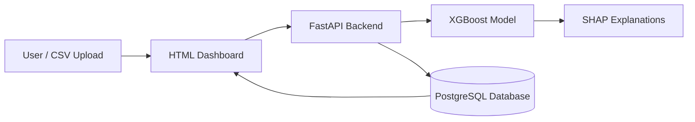

# 🛡️ Fraud Detection System – Production ML + API + Dashboard

An end-to-end fraud detection system built using **XGBoost**, **FastAPI**, **PostgreSQL**, and a modern **HTML/JavaScript dashboard**.

The system predicts fraudulent transactions, provides explainable AI insights using SHAP, stores transaction history in PostgreSQL, and is fully deployable using free cloud services.

---

## 🚀 Features

* XGBoost fraud detection model
* FastAPI REST API
* PostgreSQL transaction storage
* SHAP explainability
* Interactive HTML dashboard
* Batch CSV processing
* Risk scoring engine
* Transaction history tracking
* Docker support
* Cloud deployment ready
* Modular production architecture

---

## 🏗️ System Architecture



---

## 📁 Project Structure

```text
fraud_detection/
│
├── .env.example
├── .gitignore
├── Dockerfile
├── docker-compose.yml
├── requirements.txt
│
├── main.py
├── train.py
├── evaluate_model.py
├── live_stream_review_focused.py
│
├── tests/
│   ├── __init__.py
│   └── test_connection.py
│
├── frontend/
│   ├── index.html
│   └── Marvin.jpg
│
├── models_store/
│   ├── best_model.pkl
│   ├── scaler.pkl
│   ├── amount_bins.pkl
│   ├── feature_names.pkl
│   └── optimal_threshold.pkl
│
└── fraud_detection/
    │
    ├── api/
    │   ├── dependencies.py
    │   ├── auth.py
    │   └── routes/
    │       ├── health.py
    │       ├── model.py
    │       ├── predictions.py
    │       ├── transactions.py
    │       ├── history.py
    │       ├── ingest.py
    │       └── auth.py
    │
    ├── application/
    │   └── services/
    │       ├── prediction_service.py
    │       └── decision_service.py
    │
    ├── infrastructure/
    │   ├── database/
    │   └── repositories/
    │
    ├── ml/
    │   ├── feature_engineering.py
    │   └── inference/
    │       ├── model_loader.py
    │       └── explainability.py
    │
    ├── schemas/
    ├── core/
    └── utils/
```

---

## 🧠 Model Performance

| Metric              | Value  |
| ------------------- | ------ |
| ROC-AUC             | 0.9816 |
| F1 Score            | 0.8677 |
| Recall              | 85.7%  |
| False Positive Rate | 0.07%  |

**Result:** Ready for low-false-alarm fraud detection.

---

## 🛠 Technology Stack

| Layer            | Technology            |
| ---------------- | --------------------- |
| Machine Learning | XGBoost               |
| API              | FastAPI               |
| Database         | PostgreSQL            |
| Explainability   | SHAP                  |
| Frontend         | HTML, CSS, JavaScript |
| Deployment       | Render                |
| Database Hosting | Neon                  |
| Frontend Hosting | Netlify / Vercel      |
| Containerization | Docker                |

---

## ☁️ Deployment Architecture

| Component | Platform         |
| --------- | ---------------- |
| API       | Render           |
| Database  | Neon PostgreSQL  |
| Dashboard | Netlify / Vercel |

---

## 🔄 Prediction Workflow

1. User uploads a CSV file.
2. Dashboard sends data to FastAPI.
3. Model generates fraud probability.
4. Risk engine determines:

   * APPROVE
   * REVIEW
   * BLOCK
5. SHAP generates explanations.
6. Results are stored in PostgreSQL.
7. Dashboard displays prediction history.

---

## 🧪 Local Installation

### Clone Repository

```bash
git clone https://github.com/MarvinVutshila/fraud-detection.git
cd fraud-detection
```

### Create Virtual Environment

#### Windows

```bash
python -m venv venv
venv\Scripts\activate
```

#### Linux / macOS

```bash
python -m venv venv
source venv/bin/activate
```

### Install Dependencies

```bash
pip install -r requirements.txt
```

### Configure Environment Variables

Create a `.env` file:

```env
DATABASE_URL=your_postgresql_connection_string

JWT_SECRET_KEY=your_secret_key

API_KEY=your_api_key

STREAM_PASSWORD=optional_password
```

### Run the API

```bash
python main.py
```

Open:

```text
http://localhost:8000
```

Swagger Documentation:

```text
http://localhost:8000/docs
```

---

## ⚠️ Production Notes

* Render free tier sleeps after inactivity.
* Neon PostgreSQL is recommended for persistence.
* The current model uses the Kaggle Credit Card Fraud dataset.
* Features V1–V28 are PCA-transformed variables from the original dataset.
* Real banking systems would require domain-specific transaction features.

---

## 🔮 Future Improvements

* JWT authentication
* Role-based access control
* CI/CD pipeline
* Model versioning
* Drift detection
* Monitoring and alerting
* Automated retraining
* Audit logging
* Kubernetes deployment

---

## 📜 License

Educational and research use only.

This project is not intended for real financial decision-making without additional validation, compliance reviews, and security controls.

---

## 👨‍💻 Author

### Marvin

Data Science & AI Engineer

Production-style Machine Learning, MLOps, and Fraud Detection Project.
